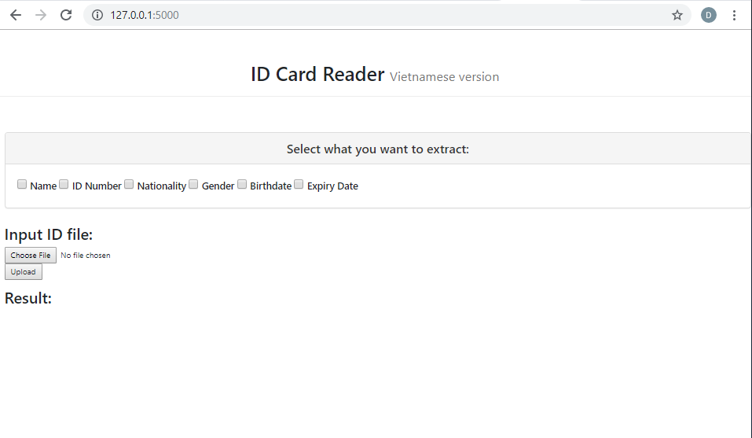
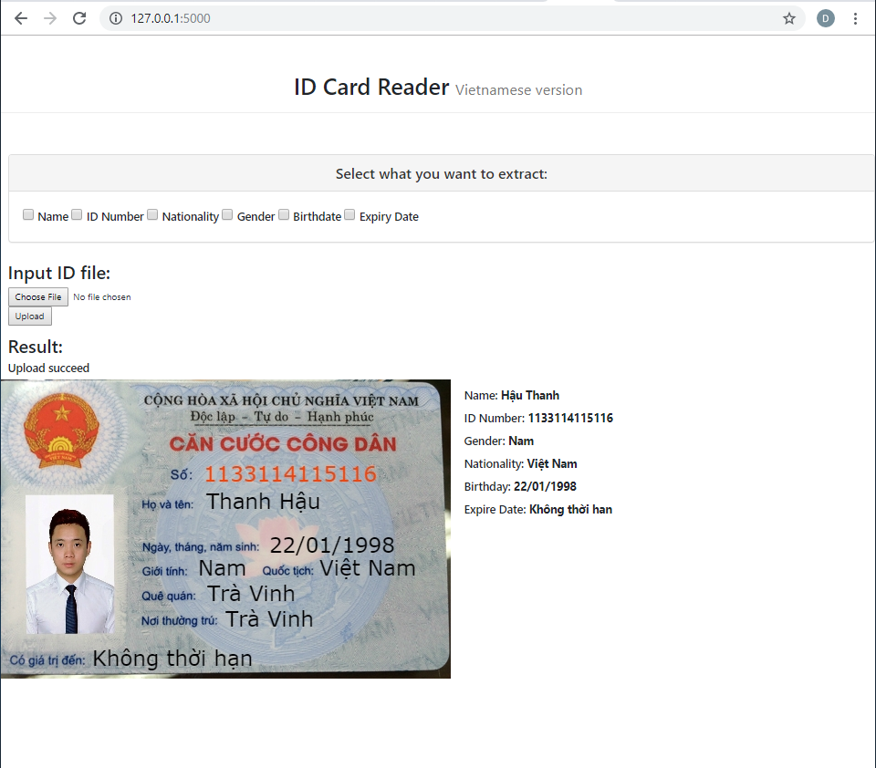

# Vietnamese ID Card Reader

A real-time OCR platform (website) for reading and extracting information from national ID cards (with Flask-based API).

## Introduction

Used Pytesseract and trained Frozen_East_Text_Detection model with Vietnamese Words file found online (to switch to another language, download another training file and change the tesseract code to file name). The program converts the picture to blobs, then decode the blobs to get boxes. Then apply non-maxima suppression to the weak and overlapping boxes. We then loop through the boxes and reads the content using Pytesseract, finding the key words that were checked.

## Getting Started

These instructions will get you a copy of the project up and running on your local machine for development and testing purposes. See deployment for notes on how to deploy the project on a live system.

### Prerequisites

What things you need to install the software and how to install them

```
Python
Pillow
Pytesseract
OpenCV2
Numpy
Imutils -> non_max_supression

```
In ocrErry.py, replace the addresses to Pytesseract file and Frozen_East_text_detection files.

## Running the tests

To run the website, run app.py on Terminal.



Check all the categories to extract from the ID Card and upload picture of ID.




## Authors

* **DucMinh Ngo**

